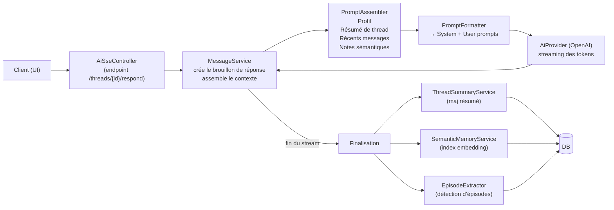
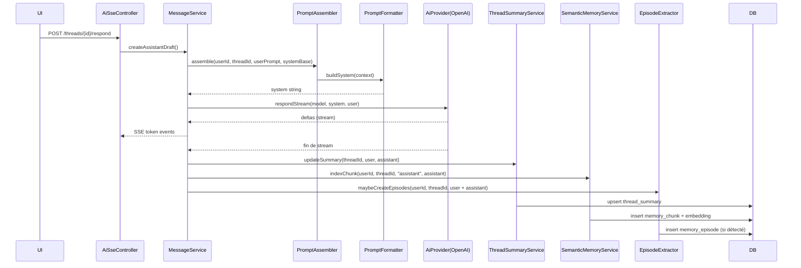

# Mémoire conversationnelle — Guide débutant (Backend + BDD)

Ce document explique, pas à pas, comment la « mémoire conversationnelle » est implémentée dans le backend et stockée en base de données. L’objectif est qu’un débutant puisse comprendre ce qui est mémorisé, quand et comment c’est réutilisé pour améliorer les réponses de l’assistant.


## TL;DR

- Le backend combine 4 sources de mémoire quand il prépare une réponse:
  1) Profil utilisateur (JSON compacté en texte) — mémoire « longue durée » par utilisateur.
  2) Résumé du thread — condensé des échanges précédents d’un fil précis.
  3) Mémoire sémantique (pgvector) — petits extraits pertinents retrouvés par similarité.
  4) Derniers messages du fil — une courte « fenêtre » des échanges récents.
- Après chaque réponse de l’assistant, le backend met à jour:
  - Le résumé du fil (avec un modèle de résumé léger).
  - L’index sémantique (embeddings du texte pour recherche par similarité).
  - Éventuellement des « épisodes » (décisions, préférences, échéances) détectés heuristiquement.


## Vue d’ensemble (schéma)




## Ce que la BDD stocke

Les migrations Flyway créent 4 tables dédiées à la mémoire (et l’extension `vector` pour pgvector):

- user_memory — profil utilisateur persistant (1:1 avec l’utilisateur)
  - Colonnes: `user_id` (PK), `profile_json` (JSONB), `updated_at`.
  - Migration: `src/main/resources/db/migration/V4__add_conversational_memory.sql:2`
- thread_summary — résumé condensé par fil (1:1 avec le thread)
  - Colonnes: `thread_id` (PK), `summary_text` (TEXT), `tokens_estimated`, `updated_at`.
  - Migration: `src/main/resources/db/migration/V4__add_conversational_memory.sql:9`
- memory_episode — « événements » détectés (N:1 utilisateur, optionnellement liés à un thread)
  - Colonnes: `id` (PK), `user_id`, `thread_id?`, `occurred_at`, `title`, `detail`, `created_at`.
  - Migration: `src/main/resources/db/migration/V4__add_conversational_memory.sql:17`
  - Index temps-récents: `src/main/resources/db/migration/V5__add_index_for_conversational_memory.sql:1`
- memory_chunk — mémoire sémantique (pgvector)
  - Colonnes: `id` (PK), `user_id`, `thread_id?`, `source` (user/assistant/system/note), `content` (TEXT), `embedding vector(1536)`, `created_at`.
  - Extension vector: `src/main/resources/db/migration/V4__add_conversational_memory.sql:28`
  - Table: `src/main/resources/db/migration/V4__add_conversational_memory.sql:29`
  - Index IVFFLAT embedding: `src/main/resources/db/migration/V4__add_conversational_memory.sql:39`
  - Index temps-récents: `src/main/resources/db/migration/V5__add_index_for_conversational_memory.sql:6`

Schéma ER simplifié:

```mermaid
erDiagram
    USERS ||--o{ THREADS : has
    USERS ||--o{ MEMORY_EPISODE : has
    USERS ||--o{ MEMORY_CHUNK : has

    THREADS ||--|| THREAD_SUMMARY : has
    THREADS ||--o{ MEMORY_EPISODE : may_have
    THREADS ||--o{ MEMORY_CHUNK : may_have

    USERS {
        UUID id
        ...
    }
    THREADS {
        UUID id
        UUID user_id
        ...
    }
    USER_MEMORY {
        UUID user_id PK
        JSONB profile_json
        TIMESTAMPTZ updated_at
    }
    THREAD_SUMMARY {
        UUID thread_id PK
        TEXT summary_text
        INT tokens_estimated
        TIMESTAMPTZ updated_at
    }
    MEMORY_EPISODE {
        UUID id PK
        UUID user_id
        UUID thread_id nullable
        TIMESTAMPTZ occurred_at
        TEXT title
        TEXT detail
        TIMESTAMPTZ created_at
    }
    MEMORY_CHUNK {
        UUID id PK
        UUID user_id
        UUID thread_id nullable
        TEXT source
        TEXT content
        VECTOR_1536 embedding
        TIMESTAMPTZ created_at
    }

```


## Comment le backend construit le contexte (prompt)

- Assemblage des données (profil, résumé, récents, notes sémantiques):
  - `src/main/java/com/sallyvnge/aipromptbackend/service/prompt/PromptAssembler.java:28`
    - Récupère le profil via `UserMemoryService`, le résumé du thread, les extraits sémantiques pertinents (`retrieve`), et reconstruit une fenêtre de messages récents (tail contrôlé par la config).
  - La « fenêtre récente » est construite ici: `src/main/java/com/sallyvnge/aipromptbackend/service/prompt/PromptAssembler.java:38`
- Mise en forme du prompt final envoyé au modèle:
  - `src/main/java/com/sallyvnge/aipromptbackend/service/prompt/PromptFormatter.java:10` (system)
  - `src/main/java/com/sallyvnge/aipromptbackend/service/prompt/PromptFormatter.java:33` (user)
  - La section system concatène, si présents:
    - [User Profile]
    - [Thread Summary]
    - [Recent Conversation]
    - [Relevant Notes]

Exemple de structure (simplifiée) du prompt system:

```text
<System Prompt de base>

[User Profile]
clé1=valeur1; clé2=valeur2; ...

[Thread Summary]
Résumé concis et à jour du fil

[Recent Conversation]
- [user] ...
- [assistant] ...

[Relevant Notes]
- Note sémantique 1
- Note sémantique 2
```


## Cycle de vie d’une réponse (détail)



Références code:
- Brouillon + finalisation: `src/main/java/com/sallyvnge/aipromptbackend/service/MessageService.java:93`
- Résumé de thread (mise à jour): `src/main/java/com/sallyvnge/aipromptbackend/service/memory/impl/ThreadSummaryServiceImpl.java:36`
- Index sémantique (embedding): `src/main/java/com/sallyvnge/aipromptbackend/service/memory/impl/PgvectorSemanticMemoryService.java:34`
- Recherche sémantique (top K): `src/main/java/com/sallyvnge/aipromptbackend/service/memory/impl/PgvectorSemanticMemoryService.java:50`
- Détection d’épisodes: `src/main/java/com/sallyvnge/aipromptbackend/service/memory/EpisodeExtractor.java:19`


## Mémoire sémantique (pgvector) — comment ça marche

- Embedding: à l’indexation, le texte est converti en vecteur via l’API embeddings (modèle configurable):
  - Modèle: `app.ai.model.embedding` (par défaut `text-embedding-3-small`, 1536 dims)
  - Code embedding: `src/main/java/com/sallyvnge/aipromptbackend/service/memory/impl/PgvectorSemanticMemoryService.java:69`
- Stockage: insertion dans `memory_chunk` avec la colonne `embedding vector(1536)`.
- Recherche: calcul de similarité cosinus côté Postgres avec l’opérateur `<=>` et tri croissant (plus proche d’abord):
  - `ORDER BY embedding <=> :query_embedding LIMIT k`
- Index IVFFLAT: accélère les requêtes de similarité (mieux quand il y a du volume).


## Résumé de thread — logique

- Objectif: garder une vue condensée et « durable » du fil, pour maintenir le contexte sans ré-envoyer tout l’historique.
- Mise à jour: à chaque réponse, on construit une consigne (FR) et on appelle le provider IA pour produire un résumé mis à jour, puis on compresse si besoin.
  - Implémentation: `src/main/java/com/sallyvnge/aipromptbackend/service/memory/impl/ThreadSummaryServiceImpl.java:36`
  - Modèle utilisé: `app.ai.model.summary` (ex: `gpt-5-nano`).
  - Budget tokens approximé via `TokenEstimator` (estimation grossière: ~4 caractères ≈ 1 token).


## Épisodes — logique

- But: capturer des « moments » notables (ex: décision, préférence, échéance) pour consultation rapide.
- Détection: heuristique par expressions régulières sur le texte combiné (dernier user + assistant).
  - `src/main/java/com/sallyvnge/aipromptbackend/service/memory/EpisodeExtractor.java:19`
- Persistance: `EpisodeServiceImpl.create(...)` écrit dans `memory_episode`.


## Configuration utile

- application.yml:
  - Activation mémoire sémantique: `app.memory.semantic.enabled: true/false` (`NoopSemanticMemoryService` si `false`).
  - Fenêtre des messages récents: `app.memory.summary.tail-messages`
    - Déclaré ici: `src/main/java/com/sallyvnge/aipromptbackend/config/AppMemoryProperties.java:20`
  - Budget max du résumé: `app.memory.summary.maxTokens`
  - Choix des modèles: `app.ai.model.summary`, `app.ai.model.embedding`
  - Emplacements:
    - `src/main/resources/application.yml:47` (bloc memory)
    - `src/main/resources/application.yml:55` (tail-messages)


## Prérequis BDD

- PostgreSQL avec extension `vector` (pgvector). La migration l’active:
  - `src/main/resources/db/migration/V4__add_conversational_memory.sql:28`
- Flyway applique automatiquement les migrations au démarrage.


## Fichiers clés (pour naviguer)

- Assemblage du contexte: `src/main/java/com/sallyvnge/aipromptbackend/service/prompt/PromptAssembler.java:28`
- Formatage des prompts: `src/main/java/com/sallyvnge/aipromptbackend/service/prompt/PromptFormatter.java:10`
- Flux IA + SSE: `src/main/java/com/sallyvnge/aipromptbackend/api/controller/AiSseController.java:50`
- Appels OpenAI (chat): `src/main/java/com/sallyvnge/aipromptbackend/infrastructure/OpenAiProvider.java:25`
- Résumé de thread: `src/main/java/com/sallyvnge/aipromptbackend/service/memory/impl/ThreadSummaryServiceImpl.java:36`
- Mémoire sémantique: `src/main/java/com/sallyvnge/aipromptbackend/service/memory/impl/PgvectorSemanticMemoryService.java:34`
- Épisodes: `src/main/java/com/sallyvnge/aipromptbackend/service/memory/EpisodeExtractor.java:19`
- Migrations mémoire: `src/main/resources/db/migration/V4__add_conversational_memory.sql:2`, `src/main/resources/db/migration/V5__add_index_for_conversational_memory.sql:1`


## FAQ express

- Comment désactiver la mémoire sémantique ?
  - Mettre `app.memory.semantic.enabled: false` (les recherches et l’indexation d’embeddings seront coupées, le reste fonctionne).
- Où ajuster la taille de la fenêtre récente ?
  - `app.memory.summary.tail-messages` dans `application.yml`.
- Quels textes sont indexés en sémantique ?
  - Par défaut, les réponses assistant finalisées (`source = "assistant"`).
- Quel modèle d’embedding ?
  - Configurable via `app.ai.model.embedding` (par défaut `text-embedding-3-small`).


---

Besoin d’un schéma supplémentaire ou d’exemples détaillés de prompts ? Dites-nous ce que vous voulez voir en priorité.

